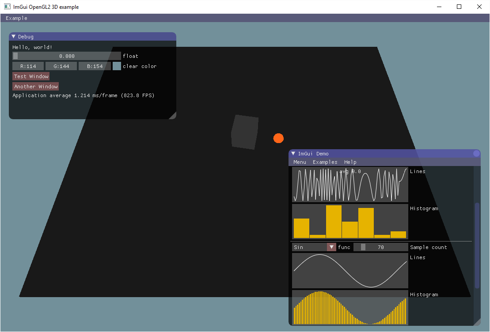

# OpenGL sample application with imgui support

## wip has moved

Future work on this repository has moved to the monorepo [valera-rozuvan/experiments](https://github.com/valera-rozuvan/experiments). This repo is archived for historic purposes (to preserve commit history). Navigate over to [experiments/opengl-sample-with-imgui](https://github.com/valera-rozuvan/experiments/tree/main/opengl-sample-with-imgui) to see updates (if any).

## introduction

Based on the work done by [johnfercher](https://github.com/johnfercher) in PR
https://github.com/ocornut/imgui/pull/606 , which didn't land in the official
[imgui repo](https://github.com/ocornut/imgui).

Tested on Windows with MSVC 2015, and on Linux with the standard GNU compiler.
